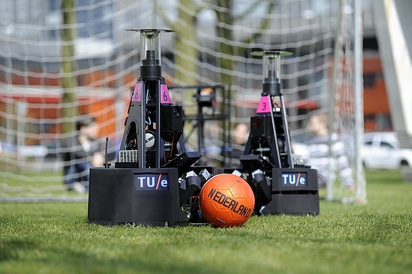
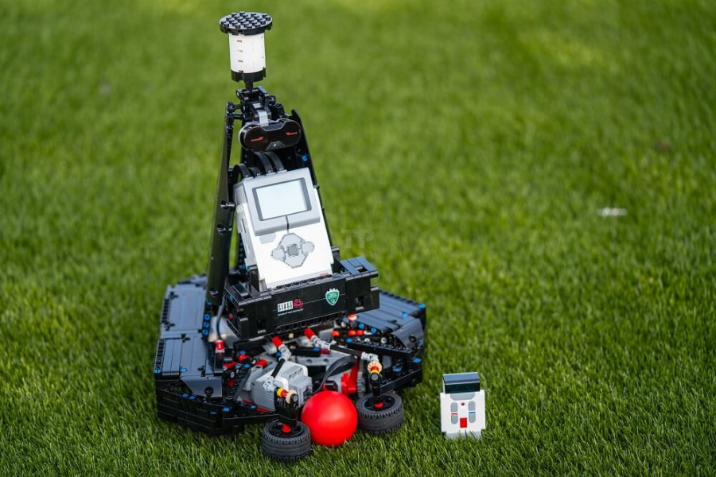
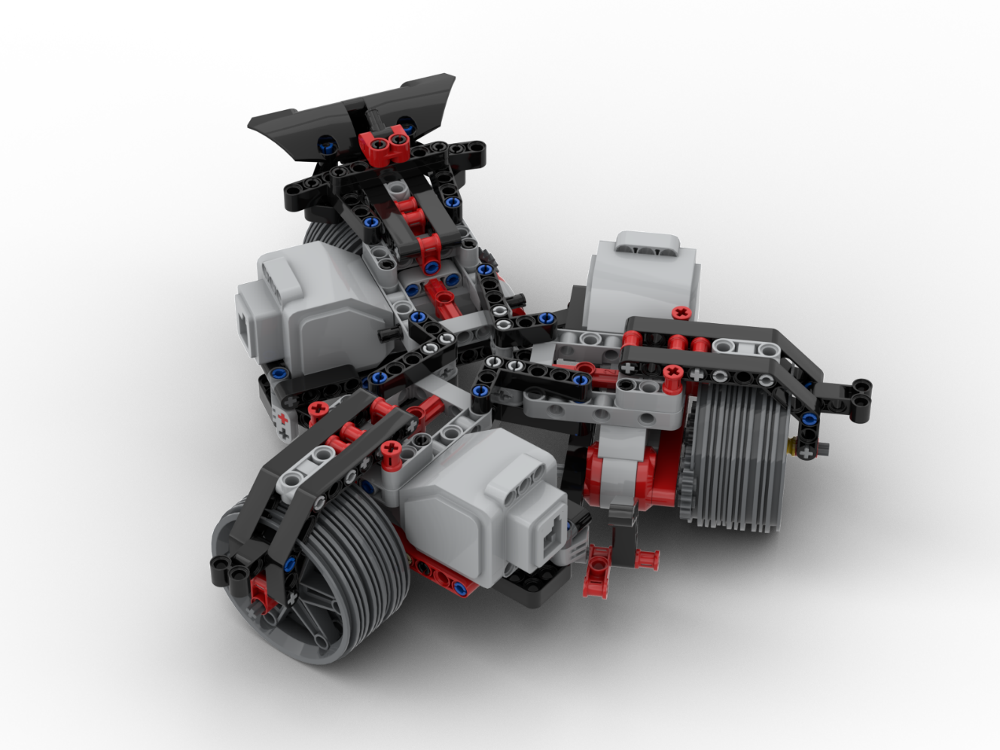
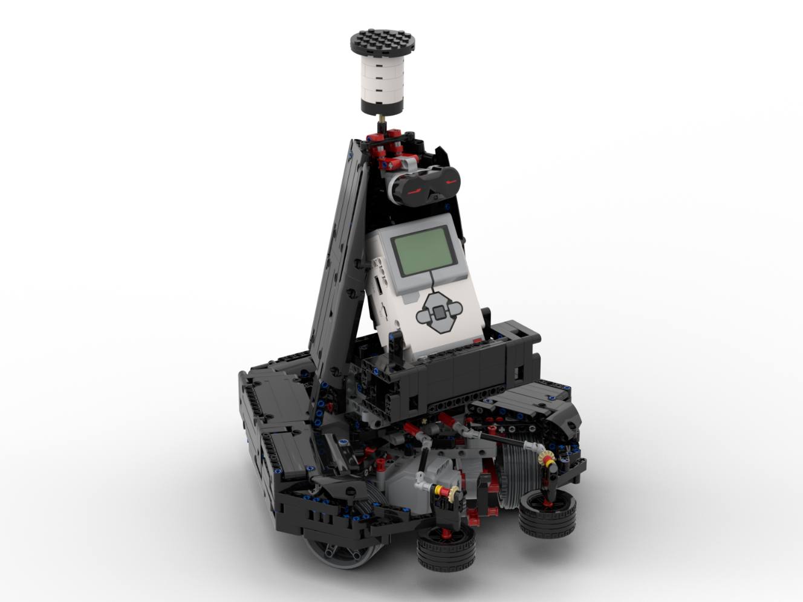
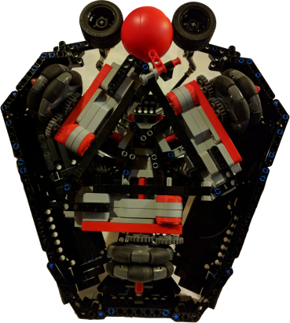
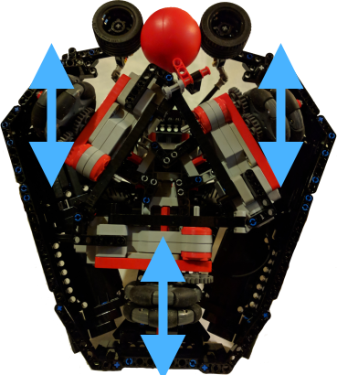
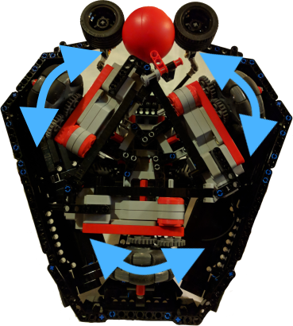
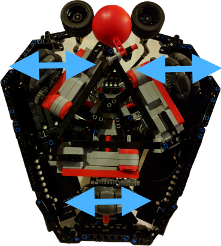

# Mindstorms Soccer Turtle Bot

This project contains the instructions to get started with your own Soccer Turtle.

This project is an entry for the [LEGO Mindstorms Voice Challenge](https://www.hackster.io/contests/alexa-lego-voice-challenge/) on [Hackster.io](https://www.hackster.io/).

In this document we will refer to the challenge and the sources provided there. Feel free to first perform the start-up mission before attempting to build the Turtle. If you want to jump right ahead in building and programming your own turtle, start with the [Setup Instructions](SETUP.md).

You can build and program your own Turtle. This turtle fully autonomously listens to your commands and you can coach the Turtle to victory.

## Repository Overview

In this section we will briefly describe what each folder contains:

| Folder            | Contents                                                   |
| ----------------- | ---------------------------------------------------------- |
| .vscode           | The configuration for your VS Code application             |
| attachments       | Files referred to in this document, like building instructions |
| emoticons         | Emoticon images                                            |
| ev3-code-python   | The Python code that runs on the EV3 brick                 |
| readme-images     | Images used in the README documents                        |
| skill-code-nodejs | Node.JS code that runs as an Alexa skill                   |

## Background story

The goal of this robot is to make children enthusiastic about technology. Technology controls and simplifies an ever larger part of our lives. Hans: "We want to let children experience technology by themselves. We live in a world where the role of technology becomes more and more important, but at the same time, there is also a shortage of engineers. So we must do everything we can, to fill this gap and get the engineers of the future excited." With our Turtle we hope to make kids enthusiastic for technology and develop themselves to become better builders of tomorrow.

## What is a Turtle

TURTLEs are the football robots that compete in the [RoboCup Mid-Size League](https://www.robocup.org/leagues/6) (MSL) for [Eindhoven University of Technology](https://www.tue.nl/en/research/research-institutes/robotics-research/projects/robocup-mid-size-soccer/). In the MSL two teams of 5 robots, each with a height of approximately 80 cm, play soccer against each other. This is performed completely autonomous. This means that the robots take all the decisions by themselves. You can think about tactics, the moment of shooting and the position in the field. The big goal for these Leagues is to develop a robot soccer team which will win from the World Champion human soccer in 2050.



### Turtles in action

](readme-images/real-turtle-in-action.png)

](readme-images/lego-turtle-in-action.png)

## How to build your own



### Parts

To build your own Turtle you will need the Mindstorms EV3 kit [#31313](https://www.lego.com/nl-nl/product/lego-mindstorms-ev3-31313) in addition to the components described in the attached [Order List](attachments/Tech_United_Robot_-_Order_List.xlsx), including component images for convenience. For the Turtle to be able move around in all directions with only 3 wheels we make use of omni wheels. For more information on omni wheels check [this Wikipedia article](https://en.wikipedia.org/wiki/Omni_wheel). Omni wheels are wheels that can travel in all directions instead of just two of normal wheels. In the programming section we will explain how to employ these cool wheels. Unfortunately LEGO does not have omni wheel components, so we use "Omni Wheel 58 mm" from [Nexus Robots](http://www.nexusrobot.com/) instead (also see [Order List](attachments/Tech_United_Robot_-_Order_List.xlsx) for ordering options).

### Instructions

The [building instructions](attachments/Lego_Instructions_Soccer_Robot.pdf) can be found in a separate PDF file, which can be opened with any PDF reader like [Acrobat Reader](https://get.adobe.com/reader/), [SumatraPDF](https://sumatra-pdf.en.softonic.com/), and most browsers (Firefox, Chrome, and Edge).

### Programming

In this project we will program the Turtle using Ev3Dev and Python. To start connecting your EV3 to Alexa follow the [Setup and mission described on the Challenge](https://www.hackster.io/alexagadgets/lego-mindstorms-voice-challenge-setup-17300f). If you want to skip those and jump right ahead, follow the instructions in [Setup](SETUP.md).

The following subsections describe how to program the Turtle and continue where the setup and missions ended. Specifically, it means your EV3 is already setup with EV3Dev as well as able to connect to your Alexa product and VSCode is setup to connect to your EV3 and run Python code.

 The movement of the Turtle can be done after step 59 in the building instructions. Just connect the left motor to port A, right to B and back motor to C. Note that the black beam added in step 59 is at the front of the Turtle and the "spoiler" is at the back.



 The taking and shooting of the ball can be done after step 153 in the building instructions. Just connect the medium motor to port D. However, we recommend building the turtle to completion (step 168).



#### Setting up the motors and sensors

The Turtle uses 3 large motors for the movement and 1 medium motor for taking and shooting the ball. To measure the distance (or to control the Turtle using the IR remote control) it has an IR sensor mounted on top. So the EV3 needs to be initialized accordingly:

```python
class MindstormsGadget(AlexaGadget):
    def __init__(self):
        super().__init__()

        # Ev3dev initialization
        self.leds = Leds()
        self.sound = Sound()
        self.motorLeft = LargeMotor(OUTPUT_A)
        self.motorRight = LargeMotor(OUTPUT_B)
        self.motorBack = LargeMotor(OUTPUT_C)
        self.motorBall = MediumMotor(OUTPUT_D)
        self.ir = InfraredSensor()
```

#### Moving the Turtle

Moving the Turtle is more complicated than moving a car, since we need to use all three wheels to move. One noticeable advantage of omni wheels over normal wheels is that we can move side ways as well as forwards and backwards.

Below is an sketch of the wheel configuration. The concept behind the triangle is that we can move in all directions with just 3 wheels. We will refer to this sketch in the following sections when programming a specific direction.



##### Move Forwards and Backwards

So let's start with moving forwards. To move forward we need to enable both front motors (port A and B). These motors need to be set to the same speed and rotate in opposite directions. The opposite direction is because the motors are positioned in opposite directions. We want the wheels to rotate in the same directions and therefore one motor needs to be set to a negative speed. In summary, to move forward we set motor A to 25% power and motor B to -25% power. In this example we use 2 seconds for the duration.



It is important that the control of the motors is non-blocking, since we want to control both motors at the same time. You could achieve this using a tank control, however, we need to control different sets of motors in different directions.

```python
if direction in Direction.FORWARD.value:
    self.motorLeft.on_for_seconds(SpeedPercent(25), 2, block=False)
    self.motorRight.on_for_seconds(SpeedPercent(-25), 2, block=False)
```

When moving backwards, just reverse the direction and the Turtle backs up.

```python
if direction in Direction.BACKWARD.value:
    self.motorLeft.on_for_seconds(SpeedPercent(-25), 2, block=False)
    self.motorRight.on_for_seconds(SpeedPercent(25), 2, block=False)
```

##### Rotating

Rotating the turtle around it's center point is relatively easy. Just rotate all wheels in the same direction. So we enable all large motors with the same speed and duration. Again it is important to make the control non-blocking, since all motors need to be moving at the same time.



```python
if direction in Direction.LEFT.value:
    self.motorLeft.on_for_seconds(SpeedPercent(25), 2, block=False)
    self.motorRight.on_for_seconds(SpeedPercent(25), 2, block=False)
    self.motorBack.on_for_seconds(SpeedPercent(25), 2, block=False)
```

##### Move Sideways

Now we have covered the basic movement and lets dive into the movements that make omni wheels so cool: Moving sideways. For the sideways movement we need to enable all large motors. We cannot just set the same speed to all, since then the Turtle will rotate during its movement (also cool, but left as an experiment to the reader). Instead we need to make sure that the back wheel does not rotate and follows a straight line. We do that by applying less power to the front wheels, specifically half the power. The front wheels need to move in opposite direction. The reason is that motor A needs to counter act the rotation of motor B and thereby keep the Turtle straight. It might sound counter intuitive, so just play around with different values using the python snippets provided or the [LEGO Mindstorms EV3 Home Edition software](https://www.lego.com/en-us/themes/mindstorms/downloads).



```python
if direction in Direction.LEFT.value:
    self.motorLeft.on_for_seconds(SpeedPercent(12.5), 2, block=False)
    self.motorRight.on_for_seconds(SpeedPercent(12.5), 2, block=False)
    self.motorBack.on_for_seconds(SpeedPercent(-25), 2, block=False)

if direction in Direction.RIGHT.value:
    self.motorLeft.on_for_seconds(SpeedPercent(-12.5), 2, block=False)
    self.motorRight.on_for_seconds(SpeedPercent(-12.5), 2, block=False)
    self.motorBack.on_for_seconds(SpeedPercent(25), 2, block=False)
```

##### Moving Diagonally

As mentioned before the omni wheels enable the Turtle to move in all directions. TAs illustration we will move the Turtle diagonally. When moving diagonally, all motors use a different speed. The back motor is used to steer the Turtle in the right horizontal direction (left or right) and the front wheels are used to get the vertical direction (forward and backward). Combining these two movements we get a diagonal move. In this illustration we only move the Turtle forward left or north west. Note that when reversing all speeds, the Turtle will move backwards right or south east. This is because each of the directions is reversed (forward to backward and left to right).

```python
if direction in Direction.FORWARD_LEFT.value:
    self.motorLeft.on_for_seconds(SpeedPercent(20), 2, block=is_blocking)
    self.motorRight.on_for_seconds(SpeedPercent(-5), 2, block=is_blocking)
    self.motorBack.on_for_seconds(SpeedPercent(-10), 2, block=is_blocking)
```

#### Taking the Ball and Scoring

A moving Turtle is nice, but without a ball you cannot become world champion. In this section we will tackle the taking and shooting of the ball.

##### Grabbing the ball

To take the ball the wheels on the front need to rotate inwards and grasp the ball. This should happen on a low speed to prevent the ball from bouncing off the wheels.

```python
if command in Command.TAKE.value:
    self.motorBall.on(SpeedPercent(5))
```

We just powered on the motor and now we need to detect when we have grabbed the ball and took control. For this we add a flag that indicates if we are in taking mode.

```python
if command in Command.TAKE.value:
    self.motorBall.on(SpeedPercent(5))
    self.taking_mode = True
```

Also we need to add a background thread to the initialization. So we add the initialization of the flag as well as start the background thread.

```python
class MindstormsGadget(AlexaGadget):
    def __init__(self):
        super().__init__()

        # Gadget state
        self.taking_mode = False
        self.scoring_mode = False

        # Start threads
        threading.Thread(target=self._take_stop_thread, daemon=True).start()
```

The logic of the `_take_stop_thread` is to monitor the power needed to rotate the wheels. When the power needed is too high we know we have taken the ball, since the ball is blocking the wheels from moving and hence the motor tries to increase the power for the movement.

The function keeps looping (`while True:`) and if we are in `taking_mode` then it checks the power. To prevent stopping the motor to early we make sure we get three measurements in a row that indicate an increased motor power. When the ball is taken en blocking the wheels, we are quite sure that we get three such measurements in a row. Once we detected three measurement, we stop the motor and indicate that we are out of `taking_mode`. By setting the `scoring_mode` flag to `True` we indicate that we have taken control of the ball and are ready to score.

```python
def _take_stop_thread(self):
        """
        Monitors the power used by the motorBall motor
        """
        count = 0
        while True:
            while self.taking_mode:
                power = self.motorBall.duty_cycle
                print("Duty Cycle: {}".format(power), file=sys.stderr)
                count = count + 1 if power > 40 else 0
                if count > 3:
                    self.motorBall.stop()
                    self.taking_mode = False
                    self.scoring_mode = True

                time.sleep(0.2)
            time.sleep(1)
```

##### Shooting the ball

Shooting the ball is simpler and we just need to enable motor D for a short and quick rotation. We need a quick rotation so that the power on the wheels is transferred to the ball and the ball is shot.

```python
if command in Command.SHOOT.value:
    self.motorBall.on_for_seconds(SpeedPercent(-50), 0.2)
```

## Sources

- Turtle is from the [Tech United Team](http://www.techunited.nl/) from the [TU/e](https://www.tue.nl/en/)
- RoboCup is from [RoboCup Federation, Inc](https://www.robocup.org).
- LEGO and Mindstorms are from [LEGO Group](https://www.lego.com)
- Amazon and Alexa are from [Amazon](https://www.amazon.com/)
- Emoticons are from [Mozilla](https://emojipedia.org/mozilla/)

## Authors

We enjoyed creating and programming this Tech United Soccer Robot and hope you have as much fun building and coaching it as we did.

__Hans Odenthal__ (designing) & __Jan Willem van Silfhout__ (designing) & __Colin Lambrechts__ (programming)
